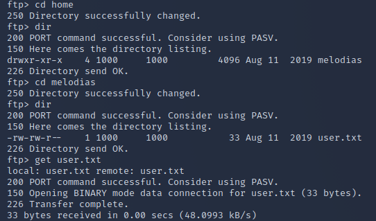
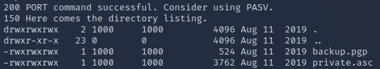
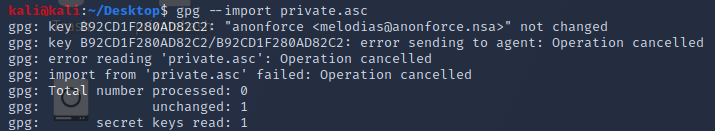
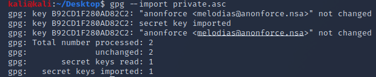
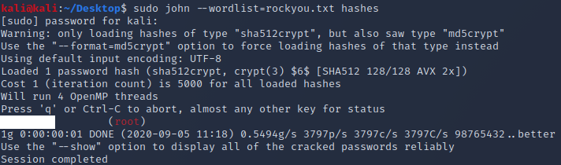
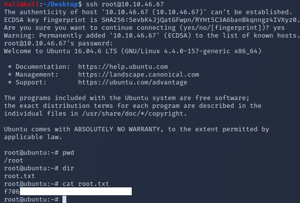

Anonforce — TryHackMe — WriteUp

Nmap
```
nmap 10.10.13.132 -A -T4 -p- 
```
```
PORT   STATE SERVICE VERSION
21/tcp open  ftp     vsftpd 3.0.3
| ftp-anon: Anonymous FTP login allowed (FTP code 230)
| drwxr-xr-x    2 0        0            4096 Aug 11  2019 bin
| drwxr-xr-x    3 0        0            4096 Aug 11  2019 boot
| drwxr-xr-x   17 0        0            3700 Sep 05 00:59 dev
| drwxr-xr-x   85 0        0            4096 Aug 13  2019 etc
| drwxr-xr-x    3 0        0            4096 Aug 11  2019 home
| lrwxrwxrwx    1 0        0              33 Aug 11  2019 initrd.img -> boot/initrd.img-4.4.0-157-generic
| lrwxrwxrwx    1 0        0              33 Aug 11  2019 initrd.img.old -> boot/initrd.img-4.4.0-142-generic
| drwxr-xr-x   19 0        0            4096 Aug 11  2019 lib
| drwxr-xr-x    2 0        0            4096 Aug 11  2019 lib64
| drwx------    2 0        0           16384 Aug 11  2019 lost+found
| drwxr-xr-x    4 0        0            4096 Aug 11  2019 media
| drwxr-xr-x    2 0        0            4096 Feb 26  2019 mnt
| drwxrwxrwx    2 1000     1000         4096 Aug 11  2019 notread [NSE: writeable]
| drwxr-xr-x    2 0        0            4096 Aug 11  2019 opt
| dr-xr-xr-x  102 0        0               0 Sep 05 00:59 proc
| drwx------    3 0        0            4096 Aug 11  2019 root
| drwxr-xr-x   18 0        0             540 Sep 05 00:59 run
| drwxr-xr-x    2 0        0           12288 Aug 11  2019 sbin
| drwxr-xr-x    3 0        0            4096 Aug 11  2019 srv
| dr-xr-xr-x   13 0        0               0 Sep 05 00:59 sys
|_Only 20 shown. Use --script-args ftp-anon.maxlist=-1 to see all.
| ftp-syst: 
|   STAT: 
| FTP server status:
|      Connected to ::ffff:10.9.29.24
|      Logged in as ftp
|      TYPE: ASCII
|      No session bandwidth limit
|      Session timeout in seconds is 300
|      Control connection is plain text
|      Data connections will be plain text
|      At session startup, client count was 2
|      vsFTPd 3.0.3 - secure, fast, stable                                                                                                                                                                                                 
|_End of status                                                                                                                                                                                                                            
22/tcp open  ssh     OpenSSH 7.2p2 Ubuntu 4ubuntu2.8 (Ubuntu Linux; protocol 2.0)                                                                                                                                                                                                                                                                                                                                                                                                                                                                                                                                                               
Service Info: OSs: Unix, Linux; CPE: cpe:/o:linux:linux_kernel
```
Có vẻ như chúng ta đã mở cổng 21 và cổng 22 trên máy chủ. Cổng 21 có vẻ bị cấu hình sai, hãy xem xét kỹ hơn.
Chúng ta có thể đăng nhập vào FTP bằng tên người dùng ẩn danh và chỉ định bất kỳ thông tin nào cho mật khẩu.
Ngay lập tức chúng ta có thể cd vào trang chủ và xác định người dùng có thể sử dụng SSH và lấy cờ user.txt.  


Nhìn vào các thư mục, chúng ta có thể thấy một thư mục có tên là "notread" liệt kê các nội dung sau:  \


Chúng ta có thể tải xuống cả hai tệp này bằng lệnh mget *.
Sau khi tải xuống các tệp, chúng ta cần giải mã các tệp, vì vậy trước tiên chúng ta nên sử dụng lệnh gpg để thử nhập tệp khóa riêng private.asc. Rất tiếc, chúng ta cần mật khẩu để hoàn tất quá trình này.  


Chúng ta có thể thử băm tệp và chạy nó thông qua John The Ripper. Chúng ta cần mô-đun gpg2john, thường được cài đặt sẵn với John The Ripper. Như bạn có thể thấy bên dưới, chúng ta định vị mô-đun, sau đó thực thi nó và định nghĩa tệp khóa riêng tư cùng với lệnh locate để xuất ra mã băm:  


Sau khi băm, chúng ta có thể chạy John. Tôi đã xóa mật khẩu khỏi hình ảnh sau theo hướng dẫn của THM.


Bây giờ chúng ta có thể thử nhập lại khóa private.asc và khi được yêu cầu nhập mật khẩu, tôi đã nhập mật khẩu mà John đã bẻ khóa.




Bây giờ chúng ta đã nhập khóa. Tiếp theo, chúng ta cần xem khóa này có giải mã được tệp backup.pgp mà chúng ta đã tải xuống trước đó hay không.
Sau khi chạy lệnh bên dưới và nhập mật khẩu đã lấy trước đó, chúng ta có thể thấy backup.pgp có vẻ là bản sao lưu của /etc/shadow.


Chúng ta có thể chạy tệp này với John để xem liệu chúng ta có thể bẻ khóa được mã băm của tài khoản hay không.



Trong trường hợp này, tôi chỉ tìm được mã băm cho tài khoản root. Tôi đã thử thêm vài mật khẩu nữa nhưng vẫn không tìm được tài khoản người dùng. Hãy xem liệu chúng ta có thể SSH vào root được không vì cổng 22 đang mở.




Như bạn có thể thấy ở trên, tôi có thể đăng nhập bằng mật khẩu bị John bẻ khóa và có thể đọc được cờ gốc.
