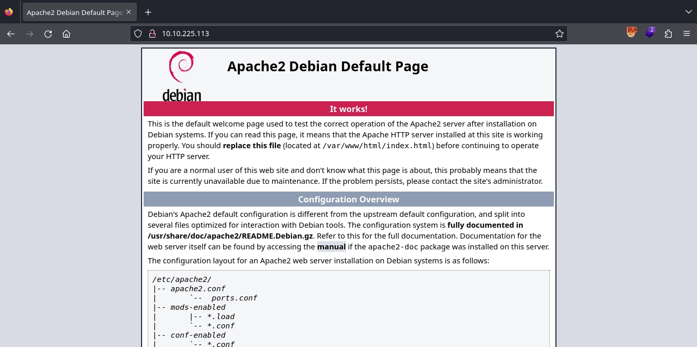

TryHackMe: Breakme
Initial Enumeration
Nmap Scan
```
$ nmap -T4 -n -sC -sV -Pn -p- 10.10.225.113
Nmap scan report for 10.10.225.113
Host is up (0.099s latency).
Not shown: 65533 closed tcp ports (reset)
PORT   STATE SERVICE VERSION
22/tcp open  ssh     OpenSSH 8.4p1 Debian 5+deb11u1 (protocol 2.0)
| ssh-hostkey:
|   3072 8e:4f:77:7f:f6:aa:6a:dc:17:c9:bf:5a:2b:eb:8c:41 (RSA)
|   256 a3:9c:66:73:fc:b9:23:c0:0f:da:1d:c9:84:d6:b1:4a (ECDSA)
|_  256 6d:c2:0e:89:25:55:10:a9:9e:41:6e:0d:81:9a:17:cb (ED25519)
80/tcp open  http    Apache httpd 2.4.56 ((Debian))
|_http-server-header: Apache/2.4.56 (Debian)
|_http-title: Apache2 Debian Default Page: It works
Service Info: OS: Linux; CPE: cpe:/o:linux:linux_kernel
```
There are two open ports:

22/SSH
80/HTTP
Web 80
Visiting http://10.10.225.113/ displays the default page for Apache.

