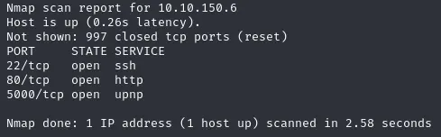
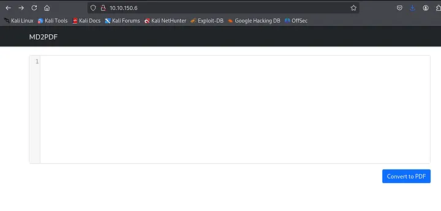
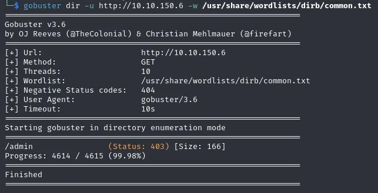
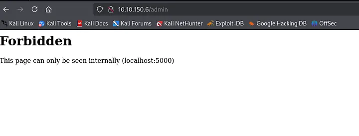
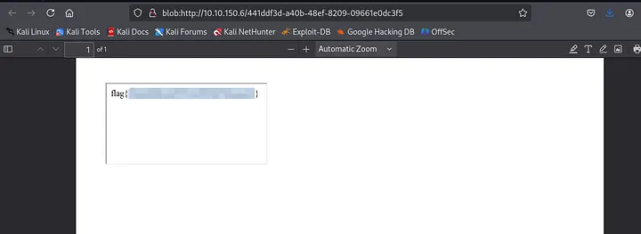

TryHackMe: MD2PDF
Tổng quan
MD2PDF là một phòng được thiết kế để minh họa các rủi ro bảo mật liên quan đến việc tạo PDF trên máy chủ, đặc biệt là khi Markdown hoặc HTML do người dùng cung cấp được hiển thị thành tài liệu. Hộp này khá thân thiện với người mới bắt đầu nhưng cũng tinh tế làm nổi bật việc khai thác SSRF trong thực tế thông qua việc chèn HTML.

Trinh sát ban đầu
Bước 1: Quét Nmap
```
nmap <địa chỉ IP mục tiêu>
```

Tôi đã tìm thấy:

Cổng 80
Cổng 5000
Cả hai dường như đều lưu trữ các ứng dụng web tương tự nhau. Đã đến lúc tìm hiểu sâu hơn.

Khám phá Giao diện Web
Duyệt đến http://<IP>cung cấp một giao diện web tối giản — một hộp văn bản để nhập Markdown và một nút gửi. Ứng dụng chuyển đổi Markdown thành PDF có thể tải xuống.


Đã thử một vài đầu vào Markdown ( **bold**, # Heading, v.v.) — hoạt động như mong đợi. Giao diện gọn gàng, không có công cụ phát triển nào hiển thị, trường ẩn hoặc tệp JS bị lộ.
Đã thử kiểm tra mã nguồn và robots.txt — không có gì đáng chú ý.

Thư mục nhanh Bruteforce
```
gobuster dir -u http://<IP> -w /usr/share/wordlists/dirb/common.txt
```


Đã phát hiện:
```
/admin
```
Trở về thăm /admin:
403 Bị cấm — Chỉ có thể truy cập từ 127.0.0.1



Trang quản trị không thể truy cập
Đó là manh mối lớn đầu tiên của chúng ta. Có gì đó đằng sau /admin, nhưng chỉ khi yêu cầu đến từ localhost. Nghe có vẻ giống một cơ hội SSRF.

Markdown + HTML = Vũ khí
Thoạt nhìn, trình phân tích cú pháp Markdown có vẻ hạn chế… cho đến khi chúng ta kiểm tra HTML thô.
```
< iframe  src = "http://localhost:5000/admin" > </ iframe >
```
Tải xuống PDF bao gồm nội dung của iframe. Trúng thưởng lớn.


Cờ trong PDF
Có vẻ như trình kết xuất PDF đang thực thi HTML bên trong Markdown trên máy chủ và iframe giải quyết thành localhost, cho phép truy cập vào bảng quản trị bị hạn chế.

Lấy lại cờ (và lý do tại sao điều này hiệu quả)
Bên trong tệp PDF (tất nhiên là đã phóng to), giờ đây chúng ta có thể xem /adminnội dung trang được hiển thị rõ ràng — bao gồm cả cờ .

Điều này hiệu quả vì wkhtmltopdf, một công cụ phổ biến để chuyển đổi HTML sang PDF, được sử dụng ngầm. Khi máy chủ hiển thị Markdown của chúng ta (có nhúng HTML), nó sẽ theo liên kết đến localhost:5000/admin, bỏ qua lỗi 403 mà chúng ta gặp phải từ trình duyệt.
