Những gì bạn sẽ học được trong hướng dẫn này
Trong hướng dẫn CTF về pin TryHackMe này, chúng ta sẽ khám phá một số kỹ thuật khai thác chính, bao gồm:

Khai thác lỗi chèn XML để truy cập dữ liệu nhạy cảm
Hiểu và tận dụng TRUNCATEcác lỗ hổng logic SQL
Bỏ qua các cơ chế xác thực bằng cách sử dụng các tải trọng được chế tạo
Thực hiện leo thang đặc quyền Linux thông qua cấu hình sai  
Enumeration
Rustscan
```
rustscan -a 10.10.78.56-- -A 

Explanation:

rustscan: Runs the RustScan port scanner.

-a 10.10.78.56: Specifies the target IP address.

--: Passes the next arguments directly to nmap.

-A: Tells nmap to perform an aggressive scan (includes OS detection, version detection, script scanning, and traceroute).
```
```
rustscan -a 10.10.78.56 -- -A                                                                                                                                                                                                           
.----. .-. .-. .----..---.  .----. .---.   .--.  .-. .-.
| {}  }| { } |{ {__ {_   _}{ {__  /  ___} / {} \ |  `| |
| .-. \| {_} |.-._} } | |  .-._} }\     }/  /\  \| |\  |
`-' `-'`-----'`----'  `-'  `----'  `---' `-'  `-'`-' `-'
The Modern Day Port Scanner.
________________________________________
: http://discord.skerritt.blog         :
: https://github.com/RustScan/RustScan :
 --------------------------------------
You miss 100% of the ports you don't scan. - RustScan

[~] The config file is expected to be at "/root/.rustscan.toml"
[!] File limit is lower than default batch size. Consider upping with --ulimit. May cause harm to sensitive servers
[!] Your file limit is very small, which negatively impacts RustScan's speed. Use the Docker image, or up the Ulimit with '--ulimit 5000'. 
Open 10.10.78.56:80
Open 10.10.78.56:22
[~] Starting Script(s)
[>] Running script "nmap -vvv -p {{port}} -{{ipversion}} {{ip}} -A" on ip 10.10.78.56
Depending on the complexity of the script, results may take some time to appear.
[~] Starting Nmap 7.95 ( https://nmap.org ) at 2025-06-28 06:07 EDT
NSE: Loaded 157 scripts for scanning.
NSE: Script Pre-scanning.
NSE: Starting runlevel 1 (of 3) scan.
Initiating NSE at 06:07
Completed NSE at 06:07, 0.00s elapsed
NSE: Starting runlevel 2 (of 3) scan.
Initiating NSE at 06:07
Completed NSE at 06:07, 0.00s elapsed
NSE: Starting runlevel 3 (of 3) scan.
Initiating NSE at 06:07
Completed NSE at 06:07, 0.00s elapsed
Initiating Ping Scan at 06:07
Scanning 10.10.78.56 [4 ports]
Completed Ping Scan at 06:07, 0.25s elapsed (1 total hosts)
Initiating Parallel DNS resolution of 1 host. at 06:07
Completed Parallel DNS resolution of 1 host. at 06:07, 0.01s elapsed
DNS resolution of 1 IPs took 0.01s. Mode: Async [#: 2, OK: 1, NX: 0, DR: 0, SF: 0, TR: 1, CN: 0]
Initiating SYN Stealth Scan at 06:07
Scanning 10.10.78.56 (10.10.78.56) [2 ports]
Discovered open port 80/tcp on 10.10.78.56
Discovered open port 22/tcp on 10.10.78.56
Completed SYN Stealth Scan at 06:07, 0.20s elapsed (2 total ports)
Initiating Service scan at 06:07
Scanning 2 services on 10.10.78.56 (10.10.78.56)
Completed Service scan at 06:08, 6.39s elapsed (2 services on 1 host)
Initiating OS detection (try #1) against 10.10.78.56 (10.10.78.56)
Initiating Traceroute at 06:08
Completed Traceroute at 06:08, 3.02s elapsed
Initiating Parallel DNS resolution of 1 host. at 06:08
Completed Parallel DNS resolution of 1 host. at 06:08, 0.01s elapsed
DNS resolution of 1 IPs took 0.01s. Mode: Async [#: 2, OK: 1, NX: 0, DR: 0, SF: 0, TR: 1, CN: 0]
NSE: Script scanning 10.10.78.56.
NSE: Starting runlevel 1 (of 3) scan.
Initiating NSE at 06:08
Completed NSE at 06:08, 8.53s elapsed
NSE: Starting runlevel 2 (of 3) scan.
Initiating NSE at 06:08
Completed NSE at 06:08, 0.81s elapsed
NSE: Starting runlevel 3 (of 3) scan.
Initiating NSE at 06:08
Completed NSE at 06:08, 0.00s elapsed
Nmap scan report for 10.10.78.56 (10.10.78.56)
Host is up, received reset ttl 60 (0.20s latency).
Scanned at 2025-06-28 06:07:54 EDT for 22s

PORT   STATE SERVICE REASON         VERSION
22/tcp open  ssh     syn-ack ttl 60 OpenSSH 6.6.1p1 Ubuntu 2ubuntu2 (Ubuntu Linux; protocol 2.0)
| ssh-hostkey: 
|   1024 14:6b:67:4c:1e:89:eb:cd:47:a2:40:6f:5f:5c:8c:c2 (DSA)
| ssh-dss AAAAB3NzaC1kc3MAAACBAPe2PVDHBBlUCEtHNVxjToY/muZpZ4hrISDM7fuGOkh/Lp9gAwpEh24Y/u197WBDTihDJsDZJqrJEJSWbpiZgReyh1LtJTt3ag8GrUUDJCNx6lLUIWR5iukdpF7A2EvV4gFn7PqbmJmeeQRtB+vZJSp6VcjEG0wYOcRw2Z6N6ho3AAAAFQCg45+RiUGvOP0QLD6PPtrMfuzdQQAAAIEAxCPXZB4BiX72mJkKcVJPkqBkL3t+KkkbDCtICWi3d88rOqPAD3yRTKEsASHqSYfs6PrKBd50tVYgeL+ss9bP8liojOI7nP0WQzY2Zz+lfPa+d0uzGPcUk0Wg3EyLLrZXipUg0zhPjcXtxW9+/H1YlnIFoz8i/WWJCVaUTIR3JOoAAACBAMJ7OenvwoThUw9ynqpSoTPKYzYlM6OozdgU9d7R4XXgFXXLXrlL0Fb+w7TT4PwCQO1xJcWp5xJHi9QmXnkTvi386RQJRJyI9l5kM3E2TRWCpMMQVHya5L6PfWKf08RYGp0r3QkQKsG1WlvMxzLCRsnaVBqCLasgcabxY7w6e2EM
|   2048 66:42:f7:91:e4:7b:c6:7e:47:17:c6:27:a7:bc:6e:73 (RSA)
| ssh-rsa AAAAB3NzaC1yc2EAAAADAQABAAABAQCkDLTds2sLmn9AZ0KAl70Fu5gfx5T6MDJehrsCzWR3nIVczHLHFVP+jXDzCcB075jjXbb+6IYFOdJiqgnv6SFxk85kttdvGs/dnmJ9/btJMgqJI0agbWvMYlXrOSN26Db3ziUGrddEjTT74Z1kokg8d7uzutsfZjxxCn0q75NDfDpNNMLlstOEfMX/HtOUaLQ47IeuSpaQoUkNkHF2SGoTTpbC+avzcCNHRIZEwQ6HdA3vz1OY6TnpAk8Gu6st9XoDGblGt7xv1vyt0qUdIYaKib8ZJQyj1vb+SJx6dCljix4yDX+hbtyKn08/tRfNeRhVSIIymOTxSGzBru2mUiO5
|   256 a8:6a:92:ca:12:af:85:42:e4:9c:2b:0e:b5:fb:a8:8b (ECDSA)
| ecdsa-sha2-nistp256 AAAAE2VjZHNhLXNoYTItbmlzdHAyNTYAAAAIbmlzdHAyNTYAAABBBCYHRWUDqeSQgon8sLFyvLMQygCx01yXZR6kxiT/DnZU+3x6QmTUir0HaiwM/n3aAV7eGigds0GPBEVpmnw6iu4=
|   256 62:e4:a3:f6:c6:19:ad:30:0a:30:a1:eb:4a:d3:12:d3 (ED25519)
|_ssh-ed25519 AAAAC3NzaC1lZDI1NTE5AAAAILW7vyhbG1WLLhSEDM0dPxFisUrf7jXiYWNSTqw6Exri
80/tcp open  http    syn-ack ttl 60 Apache httpd 2.4.7 ((Ubuntu))
| http-methods: 
|_  Supported Methods: GET HEAD POST OPTIONS
|_http-server-header: Apache/2.4.7 (Ubuntu)
Warning: OSScan results may be unreliable because we could not find at least 1 open and 1 closed port
Device type: general purpose
Running: Linux 4.X|5.X
OS CPE: cpe:/o:linux:linux_kernel:4.4 cpe:/o:linux:linux_kernel:5.4
OS details: Linux 4.4, Linux 5.4
TCP/IP fingerprint:
OS:SCAN(V=7.95%E=4%D=6/28%OT=22%CT=%CU=36967%PV=Y%DS=5%DC=T%G=N%TM=685FBF10
OS:%P=x86_64-pc-linux-gnu)SEQ(SP=103%GCD=1%ISR=10A%TI=Z%CI=I%II=I%TS=8)OPS(
OS:O1=M508ST11NW6%O2=M508ST11NW6%O3=M508NNT11NW6%O4=M508ST11NW6%O5=M508ST11
OS:NW6%O6=M508ST11)WIN(W1=68DF%W2=68DF%W3=68DF%W4=68DF%W5=68DF%W6=68DF)ECN(
OS:R=Y%DF=Y%T=40%W=6903%O=M508NNSNW6%CC=Y%Q=)T1(R=Y%DF=Y%T=40%S=O%A=S+%F=AS
OS:%RD=0%Q=)T2(R=N)T3(R=N)T4(R=Y%DF=Y%T=40%W=0%S=A%A=Z%F=R%O=%RD=0%Q=)T5(R=
OS:Y%DF=Y%T=40%W=0%S=Z%A=S+%F=AR%O=%RD=0%Q=)T6(R=Y%DF=Y%T=40%W=0%S=A%A=Z%F=
OS:R%O=%RD=0%Q=)T7(R=Y%DF=Y%T=40%W=0%S=Z%A=S+%F=AR%O=%RD=0%Q=)U1(R=Y%DF=N%T
OS:=40%IPL=164%UN=0%RIPL=G%RID=G%RIPCK=G%RUCK=G%RUD=G)IE(R=Y%DFI=N%T=40%CD=
OS:S)

Uptime guess: 0.006 days (since Sat Jun 28 06:00:08 2025)
Network Distance: 5 hops
TCP Sequence Prediction: Difficulty=259 (Good luck!)
IP ID Sequence Generation: All zeros
Service Info: OS: Linux; CPE: cpe:/o:linux:linux_kernel

TRACEROUTE (using port 443/tcp)
HOP RTT       ADDRESS
1   40.65 ms  10.17.0.1 (10.17.0.1)
2   ... 4
5   181.65 ms 10.10.78.56 (10.10.78.56)

NSE: Script Post-scanning.
NSE: Starting runlevel 1 (of 3) scan.
Initiating NSE at 06:08
Completed NSE at 06:08, 0.00s elapsed
NSE: Starting runlevel 2 (of 3) scan.
Initiating NSE at 06:08
Completed NSE at 06:08, 0.00s elapsed
NSE: Starting runlevel 3 (of 3) scan.
Initiating NSE at 06:08
Completed NSE at 06:08, 0.00s elapsed
Read data files from: /usr/share/nmap
OS and Service detection performed. Please report any incorrect results at https://nmap.org/submit/ .
Nmap done: 1 IP address (1 host up) scanned in 22.72 seconds
           Raw packets sent: 48 (2.898KB) | Rcvd: 25 (1.742KB)
```
Sau đó, tôi sử dụng Dirsearch Tool để tấn công Directory Bruteforced
```
dirscan -u http: //10.10.78.56 -e php,html,txt,js,bak,zip,log,conf,inc -x 403,404
 /root/tools/dirsearch/lib/core/installation.py: 24 : Cảnh báo người dùng: pkg_resources đã bị loại bỏ khỏi API. Xem https: //setuptools.pypa.io/en/latest/pkg_resources.html. Gói pkg_resources dự kiến ​​sẽ bị xóa sớm nhất là vào ngày 30/11/2025. Không sử dụng gói này hoặc ghim vào Setuptools<81.
   import pkg_resources                                                                                                                                                                                                                       
                                                                                                                                                                                                                                            
  _|. _ _ _ _ _ _|_ v0 .4 .3                                                                                                                                                                                                            
 (_||| _) (/_(_|| (_| )                                                                                                                                                                                                                      
                                                                                                                                                                                                                                            
Phần mở rộng: php, html, txt, js, bak, zip, log, conf, inc | Phương thức HTTP: GET | Luồng: 25 | Kích thước danh sách từ: 13931                                                                                                                            
                                                                                                                                                                                                                                            
 Mục tiêu: http: //10.10.78.56/                                                                                                                                                                                                                 
                                                                                                                                                                                                                                            
 [ 06:00:22 ] Đang quét:                                                                                                                                                                                                                         
[ 06:01:06 ] 200 -    663B - /admin.php                                         
[ 06:01:42 ] 302 -    908B - /dashboard.php -> admin.php                      
[ 06:01:53 ] 200 -     2 KB - /forms.php                                         
[ 06:01:58 ] 200 -    406B - /index.html                                        
[ 06:02:09 ] 302 -      0B - /logout.php -> admin.php                         
[ 06:02:30 ] 200 -    715B - /register.php                                      
[ 06:02:31 ] 200 -    17 KB - /report                                            
[ 06:02:33 ]301 -    311B - /scripts -> http: //10.10.78.56/scripts/         
 [ 06:02:33 ] 200 -     2 KB - /scripts/
```
Đây là các Điểm cuối khác nhau, còn có một số điểm khác nữa mà tôi cũng tìm thấy khi sử dụng FFUF
Bây giờ chúng ta hãy thử ghé thăm các điểm cuối này và xem chúng ta sẽ thấy gì ở đó  

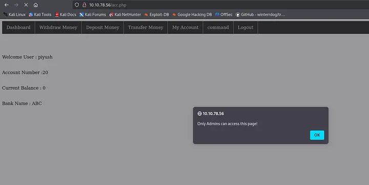

Khi tôi tạo tài khoản bằng /register.php và sau đó đăng nhập, có trang /acc.php mà tôi không thể truy cập vào đó
Bây giờ tôi thử đi đến một số điểm cuối khác và cố gắng xem ở đó tôi có thể tìm ra thêm điều gì:

Tôi phát hiện ra Endpoint này thú vị là /report
```
curl http: / /10.10.78.56/report --output report.txt 
  % Tổng % Đã nhận % Xferd Tốc độ trung bình Thời gian Thời gian Thời gian 
                                 Tải xuống hiện tại Tổng tải lên Đã sử dụng Còn lại Tốc độ 
100  16912   100  16912     0      0   23548       0 -- : -- :-- -- :-- :-- -- :-- :--  23554
```
Đầu tiên tôi cuộn yêu cầu này và đầu ra sẽ nằm trong tệp report.txt  
file report.txt
report.txt: ELF 64-bit LSB pie executable, x86–64, version 1 (SYSV), dynamically linked, interpreter /lib64/ld-linux-x86–64.so.2, BuildID[sha1]=44ffe4e81d688f7b7fe59bdf74b03f828a4ef3fe, for GNU/Linux 3.2.0, not stripped
Đây là thông tin hiển thị khi tôi sử dụng lệnh file  
```
strings report.txt
/lib64/ld-linux-x86-64.so.2
__isoc99_scanf
puts
printf
system
__cxa_finalize
strcmp
__libc_start_main
libc.so.6
GLIBC_2.7
GLIBC_2.2.5
_ITM_deregisterTMCloneTable
__gmon_start__
_ITM_registerTMCloneTable
u/UH
[]A\A]A^A_
admin@bank.a
Password Updated Successfully!
Sorry you can't update the password
Welcome Guest
===================Available Options==============
1. Check users
2. Add user
3. Delete user
4. change password
5. Exit
clear
===============List of active users================
support@bank.a
contact@bank.a
cyber@bank.a
admins@bank.a
sam@bank.a
admin0@bank.a
super_user@bank.a
control_admin@bank.a
it_admin@bank.a
Welcome To ABC DEF Bank Managemet System!
UserName : 
Password : 
guest
Your Choice : 
email : 
not available for guest account
Wrong option
Wrong username or password
;*3$"
GCC: (Debian 9.3.0-15) 9.3.0
crtstuff.c
deregister_tm_clones
__do_global_dtors_aux
completed.7452
__do_global_dtors_aux_fini_array_entry
frame_dummy
__frame_dummy_init_array_entry
report.c
__FRAME_END__
__init_array_end
_DYNAMIC
__init_array_start
__GNU_EH_FRAME_HDR
_GLOBAL_OFFSET_TABLE_
__libc_csu_fini
update
_ITM_deregisterTMCloneTable
puts@@GLIBC_2.2.5
_edata
options
system@@GLIBC_2.2.5
users
printf@@GLIBC_2.2.5
__libc_start_main@@GLIBC_2.2.5
__data_start
strcmp@@GLIBC_2.2.5
__gmon_start__
__dso_handle
_IO_stdin_used
__libc_csu_init
__bss_start
main
__isoc99_scanf@@GLIBC_2.7
__TMC_END__
_ITM_registerTMCloneTable
__cxa_finalize@@GLIBC_2.2.5
.symtab
.strtab
.shstrtab
.interp
.note.gnu.build-id
.note.ABI-tag
.gnu.hash
.dynsym
.dynstr
.gnu.version
.gnu.version_r
.rela.dyn
.rela.plt
.init
.plt.got
.text
.fini
.rodata
.eh_frame_hdr
.eh_frame
.init_array
.fini_array
.dynamic
.got.plt
.data
.bss
.comment
```
Ở đây tôi nhận được thông tin khác nhau nhưng thông tin tôi thích là về tên người dùng ở đây, ở đây chúng tôi có tên người quản trị và tên người dùng khác
Ở bảng quản trị, có thêm một lỗ hổng nữa:  

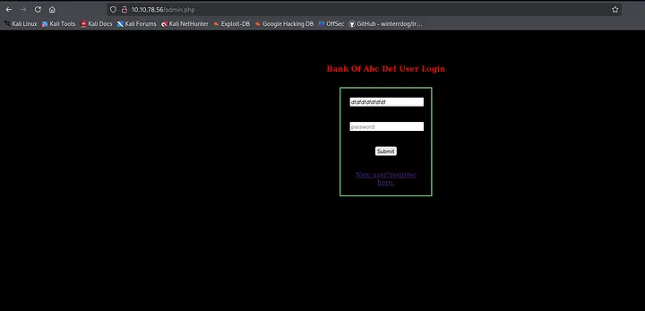

Có một số lượng ký tự cố định mà bạn có thể nhập vào tên người dùng. Tôi nghĩ là 14. Đây là lỗ hổng cắt bớt SQL mà chúng ta sẽ khai thác ngay bây giờ, hãy cùng xem nhé.
Đầu tiên, chúng ta hãy xem điều gì xảy ra khi chúng ta thử đăng ký tên người dùng quản trị này tại admin@bank.a trong trang đăng ký

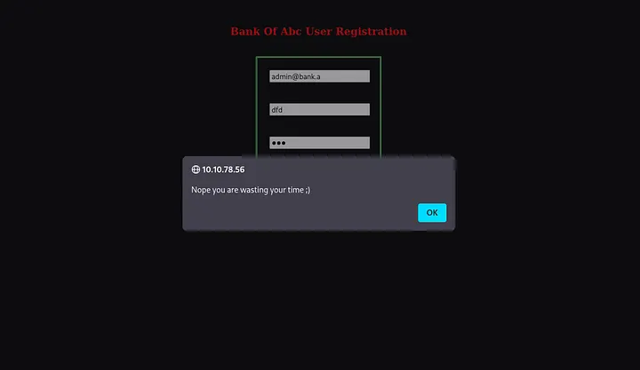

Lỗi này xuất hiện khi chúng ta thử đăng nhập bằng tên người dùng quản trị viên đó. Bây giờ chúng ta khai thác lỗ hổng này:
Chúng ta khai thác lỗ hổng này bằng cách vượt quá giới hạn ký tự trong burp bằng cách thêm khoảng trắng và hãy xem chúng ta có đăng ký thành công hay không.

Đây là Yêu cầu gốc trong burp khi chúng ta chặn nhưng bằng cách thêm khoảng trắng và tất cả thì yêu cầu sẽ tiếp tục như sau trong burp:

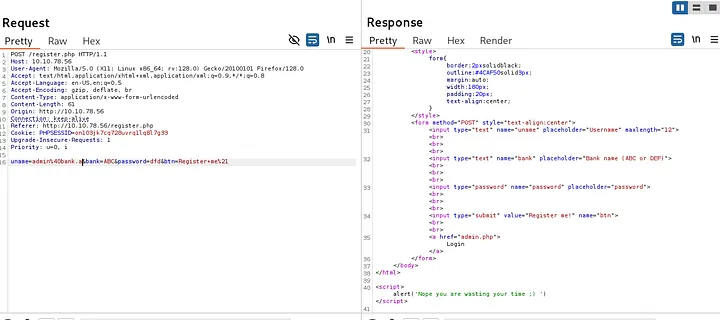

Đây là cách thực hiện và bạn thấy đấy, chúng ta có thể Đăng ký thành công tại đây trên trang này
Nhấn enter hoặc nhấp để xem hình ảnh ở kích thước đầy đủ

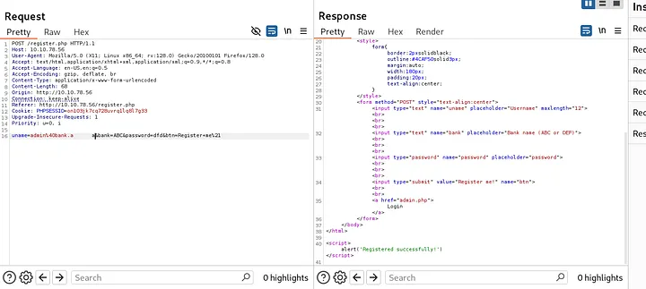

Bây giờ chúng ta hãy thử đăng nhập bằng admin@bank.a

Khi tôi vào /forms.php, tôi thấy mã xml này ở đó và ở đây tôi nhấn vào một số lệnh nhất định để thực hiện một số việc nhất định với mã xml này

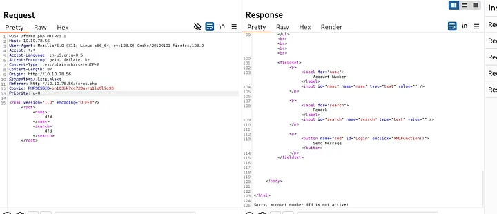  

https://github.com/swisskyrepo/PayloadsAllTheThings/blob/master/XXE%20Injection/Intruders/xml-attacks.txt

Liên kết ở trên là các tải trọng khác nhau mà bạn có thể thử và đưa vào khối mã xml này

Tôi thử sử dụng thứ đó:

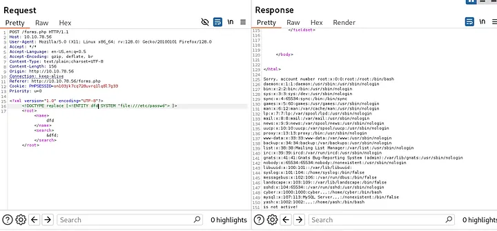  

Khi tôi cố gắng tìm file /acc.php, tôi nhận được kết quả như sau:  

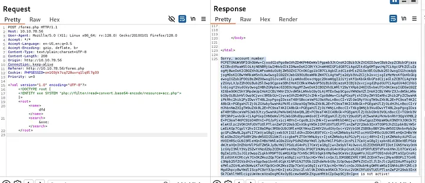  

Bây giờ tôi thử giải mã thứ này và đoán là tôi đã có được thông tin xác thực:  

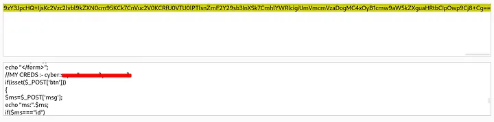 

Khám phá Flag
Tôi đã nhận được thông tin đăng nhập mà tôi đã đăng nhập qua ssh và tôi đã nhận được cờ cơ sở của mình thông qua nó

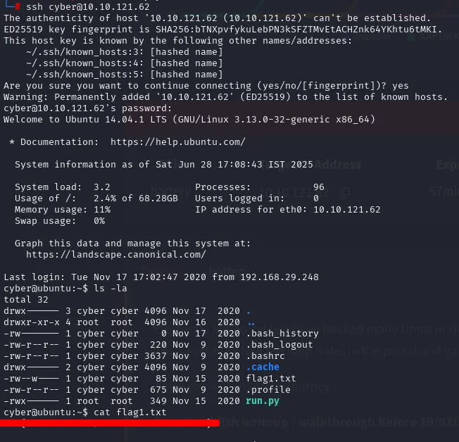    

Khám phá Flag User và Flag Root (Tăng đặc quyền)
Đầu tiên tôi chạy lệnh sudo -l để lấy quyền và nó cấp cho tôi quyền đó
```
cyber @ubuntu :~ $ sudo -l 
Các mục nhập mặc định phù hợp cho cyber trên ubuntu:
     env_reset, mail_badpass, secure_path= /usr/local /sbin\:/usr /local/bin \ :/usr/sbin \ :/usr/bin \ :/sbin \ :/bin

 Người dùng cyber có thể chạy các lệnh sau trên ubuntu:
     (root) NOPASSWD : /usr/bin /python3 /home /cyber/run .py
```
Tôi có thể chạy run.py này mà không cần mật khẩu khi tôi thấy quyền của nó

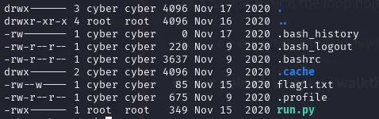    

Không có quyền nào được liệt kê cho chúng tôi với tư cách là người dùng mạng. Bây giờ tôi thử thực thi một số lệnh khác và sau đó lệnh mv hoạt động ở đây, và tôi đẩy tệp đó vào piyush.txt và nâng quyền shell lên run.py rồi thực thi nó. Ngay khi thực thi, tôi đã có quyền root.

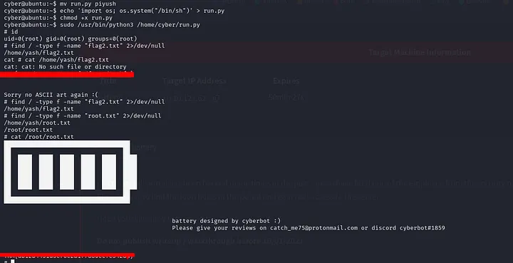    
Đây là cách chúng ta có được cả cờ người dùng và cờ gốc
